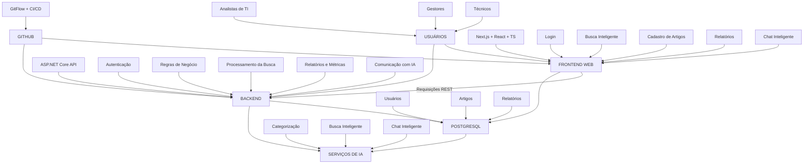

```mermaid
graph TD
    A[USUÁRIOS] --> B[FRONTEND WEB]
    A --> C[BACKEND]
    B -->|Requisições REST| C
    B --> D[POSTGRESQL]
    C --> D
    C --> E[SERVIÇOS DE IA]
    D --> E
    F[GITHUB] --> B
    F --> C

    A1[Técnicos] --> A
    A2[Gestores] --> A
    A3[Analistas de TI] --> A

    B1[Next.js + React + TS] --> B
    B2[Login] --> B
    B3[Busca Inteligente] --> B
    B4[Cadastro de Artigos] --> B
    B5[Relatórios] --> B
    B6[Chat Inteligente] --> B

    C1[ASP.NET Core API] --> C
    C2[Autenticação] --> C
    C3[Regras de Negócio] --> C
    C4[Processamento da Busca] --> C
    C5[Relatórios e Métricas] --> C
    C6[Comunicação com IA] --> C

    D1[Usuários] --> D
    D2[Artigos] --> D
    D3[Relatórios] --> D

    E1[Categorização] --> E
    E2[Busca Inteligente] --> E
    E3[Chat Inteligente] --> E

    F1[GitFlow + CI/CD] --> F
```
